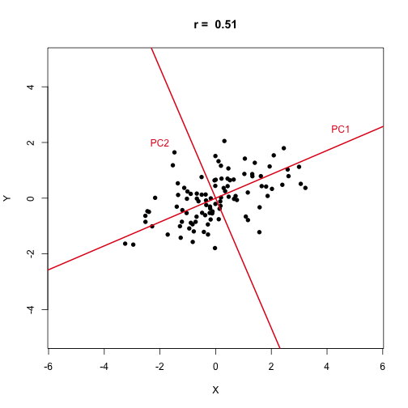
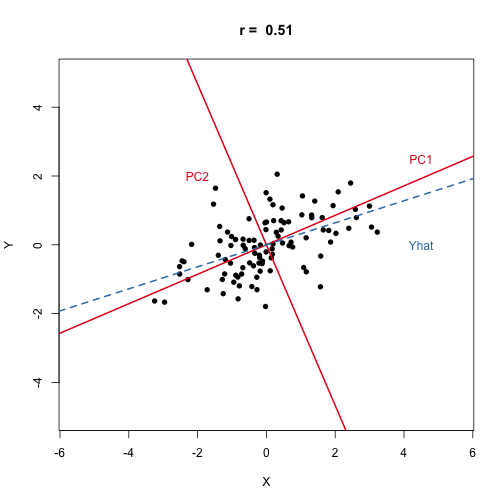
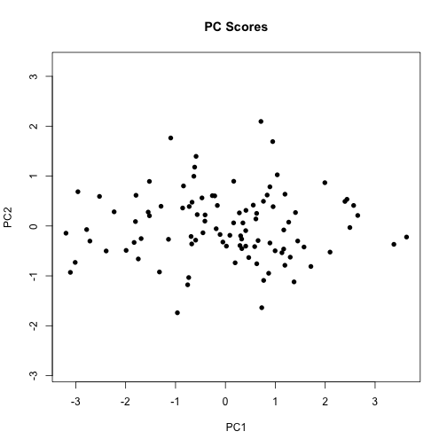
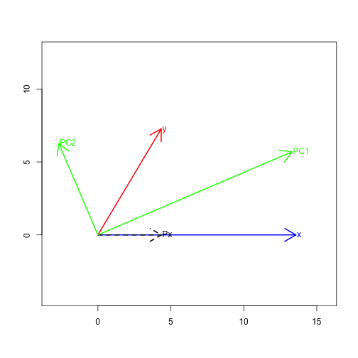

Figures for Lecture 5 slides
========================================================

## Bivariate illustration of PCA


```r
library(RColorBrewer)
library(MASS)

clrs <- brewer.pal(3, "Set1")
red <- clrs[1]
blue <- clrs[2]
green <- clrs[3]

mu <- c(0, 0)
rcov <- 0.8
sigma <- matrix(c(2, rcov, rcov, 1), 2)
z <- scale(mvrnorm(100, mu, sigma), center = T, scale = F)

X <- z[, 1]
Y <- z[, 2]
reg.YonX <- lm(Y ~ X)
reg.XonY <- lm(X ~ Y)
xy.pca <- prcomp(z, retx = TRUE)

pc1.slope <- xy.pca$rotation[2, 1]/xy.pca$rotation[1, 1]
pc2.slope <- xy.pca$rotation[2, 2]/xy.pca$rotation[1, 2]

r <- cor(X, Y)
main.txt <- paste("r = ", round(r, 2))
plot(z, asp = 1, xlab = "X", ylab = "Y", pch = 16, xlim = c(-5, 5), ylim = c(-5, 
    5), main = main.txt)

# Draw PC axes
abline(0, pc1.slope, lwd = 2, col = red)
abline(0, pc2.slope, lwd = 2, col = red)

# Label PCs
text(4.5, 2.5, "PC1", col = red)
text(-2, 2, "PC2", col = red)
```

 

```r

dev.copy(pdf, "fig-bivariate-pca.pdf")
```

```
## pdf 
##   3
```

```r
dev.off()
```

```
## pdf 
##   2
```


Plot a second time w/regressions:


```r
# plot a second time w/Regression line
plot(z, asp = 1, xlab = "X", ylab = "Y", pch = 16, xlim = c(-5, 5), ylim = c(-5, 
    5), main = main.txt)
abline(0, pc1.slope, lwd = 2, col = red)
abline(0, pc2.slope, lwd = 2, col = red)
text(4.5, 2.5, "PC1", col = red)
text(-2, 2, "PC2", col = red)
abline(reg.YonX, lty = "dashed", col = blue, lwd = 2)
# abline(reg.XonY, lty='dashed', col=blue, lwd=2)
text(4.5, 0, "Yhat", col = blue)
```

 

```r
dev.copy(pdf, "fig-bivariate-pca-wreg.pdf")
```

```
## pdf 
##   3
```

```r
dev.off()
```

```
## pdf 
##   2
```


Plot PC scores:

```r
plot(xy.pca$x, pch = 16, asp = 1, main = "PC Scores")
```

 

```r
dev.copy(pdf, "fig-bivariate-pca-scores.pdf")
```

```
## pdf 
##   3
```

```r
dev.off()
```

```
## pdf 
##   2
```


## Drawing the PCs in vector space


```r
vecangle <- function(x, y, radians = TRUE) {
    x = as.vector(x)
    y = as.vector(y)
    theta <- acos(drop(x %*% y)/(sqrt(sum(x^2)) * sqrt(sum(y^2))))
    if (!radians) 
        theta <- theta * (180/pi)
    return(theta)
}

vproj <- function(x, y) {
    x = as.vector(x)
    y = as.vector(y)
    lx <- sqrt(sum(x^2))
    Cxy <- (x %*% y)/lx
    Pxy <- Cxy * (x/lx)
    list(proj = Pxy, comp = drop(Cxy))
}

drawvectors.PC <- function(x, y) {
    x = scale(x, center = T, scale = F)
    y = scale(y, center = T, scale = F)
    lx <- sqrt(sum(x^2))
    ly <- sqrt(sum(y^2))
    A <- vecangle(x, y)
    
    newx <- c(lx, 0)
    newy <- ly * c(cos(A), sin(A))
    p <- vproj(newx, newy)
    
    XY = cbind(x, y)
    xy.pca = prcomp(XY, retx = T)
    
    z <- xy.pca$x[, 1]
    z2 <- xy.pca$x[, 2]
    
    lz <- sqrt(sum(z^2))
    lz2 <- sqrt(sum(z2^2))
    newz <- lz * xy.pca$rotation[, 1]
    if (xy.pca$rotation[1, 1] < 0) 
        newz <- lz * -xy.pca$rotation[, 1]
    newz2 <- lz2 * xy.pca$rotation[, 2]
    
    
    # setup empty plot w/appropriate axes pad values by 10 perc. to get nice
    # margins
    maxx <- max(newx[1], newy[1], newz[1], newz2[1])
    minx <- min(newx[1], newy[1], newz[1], newz2[1])
    
    maxy <- max(newx[2], newy[2], newz[2], newz2[2])
    miny <- min(newx[2], newy[2], newz[2], newz2[2])
    
    tcoords = matrix(c(maxx + 0.15 * abs(maxx), maxy + 0.15 * abs(maxy), maxx + 
        0.15 * abs(maxx), miny - 0.15 * abs(miny), minx - 0.15 * abs(minx), 
        maxy + 0.15 * abs(maxy), minx - 0.15 * abs(minx), miny - 0.15 * abs(miny)), 
        ncol = 2, byrow = TRUE)
    
    
    # type = 'n' means don't plot anything
    plot(tcoords[, 1], tcoords[, 2], type = "n", xlab = "", ylab = "", asp = 1)
    
    # draw arrows for vectors
    arrows(0, 0, newx[1], newx[2], col = "blue", lwd = 2)
    text(newx[1], newx[2], "x", pos = 4, offset = 0.1, col = "blue")
    
    arrows(0, 0, newy[1], newy[2], col = "red", lwd = 2)
    text(newy[1], newy[2], "y", pos = 4, offset = 0.1, col = "red")
    
    arrows(0, 0, p$proj[1], p$proj[2], lty = "dashed", lwd = 2)
    text(p$proj[1], p$proj[2], "Px", pos = 4, offset = 0.1)
    
    arrows(0, 0, newz[1], newz[2], col = "green", lwd = 2)
    text(newz[1], newz[2], "PC1", pos = 4, offset = 0.1, col = "green")
    
    arrows(0, 0, newz2[1], newz2[2], col = "green", lwd = 2)
    text(newz2[1], newz2[2], "PC2", pos = 4, offset = 0.1, col = "green")
    
    list(x = newx, y = newy, proj = p$proj, comp = p$comp)
}
```


And now put the `drawvectors.PC` function to use:


```r
drawvectors.PC(X, Y)
```

 

```
## $x
## [1] 13.57  0.00
## 
## $y
## [1] 4.344 7.274
## 
## $proj
## [1] 4.344 0.000
## 
## $comp
## [1] 4.344
```

```r
dev.copy(pdf, "fig-bivariate-pca-vectors.pdf")
```

```
## pdf 
##   3
```

```r
dev.off()
```

```
## pdf 
##   2
```

